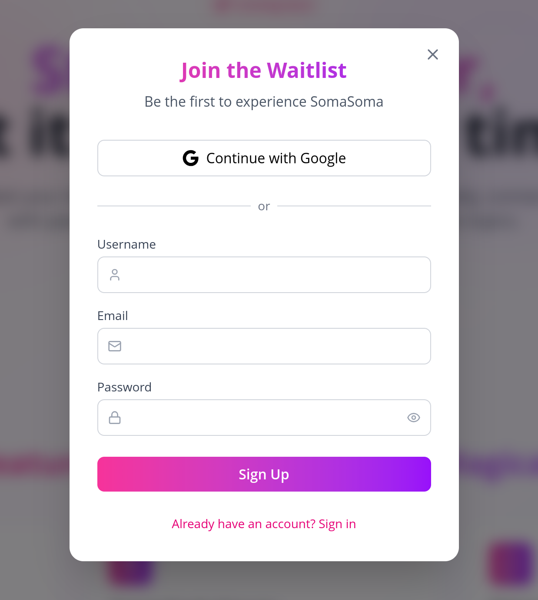
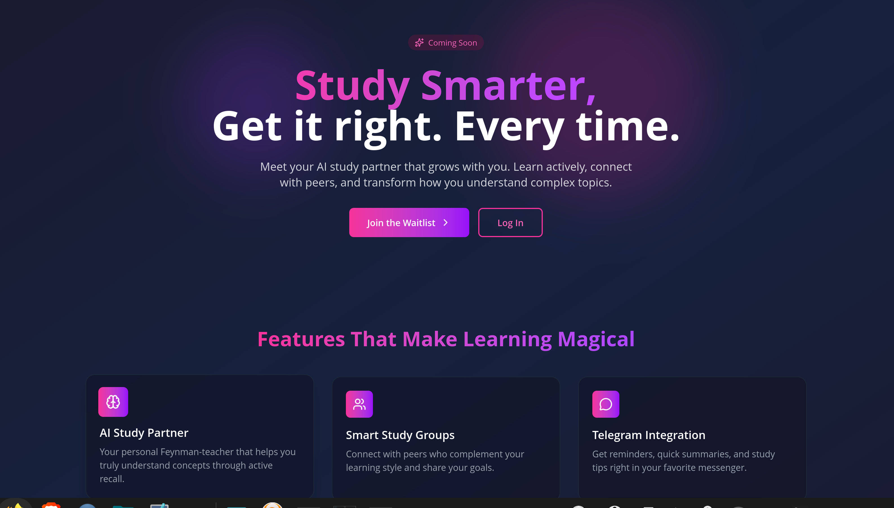
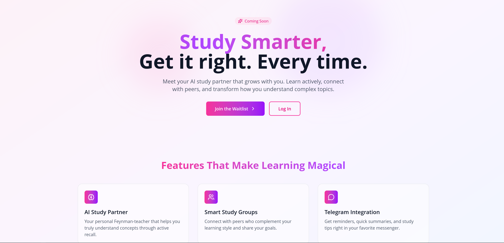
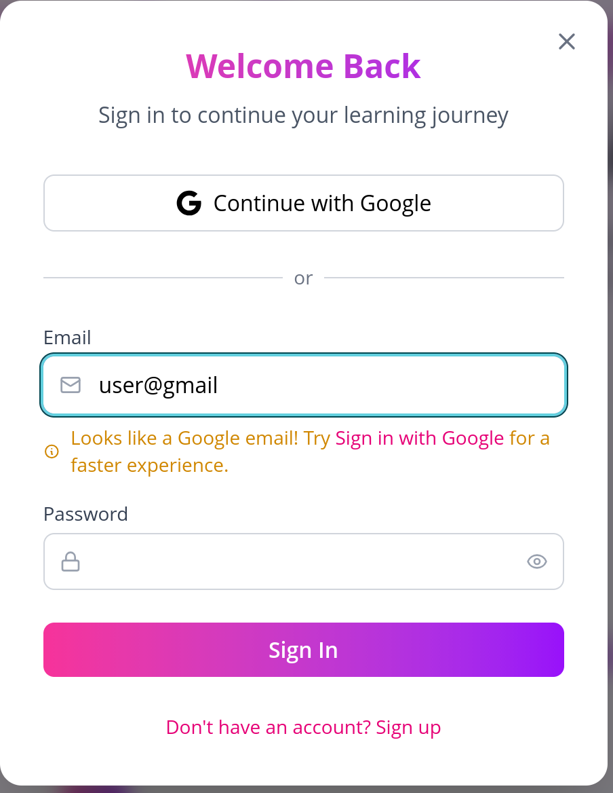

# SomaSoma / S²

> An intelligent study companion and social learning platform combining Feynman technique coaching, group learning, progress tracking, and AI-powered insights.

[](https://soma-soma.vercel.app)
[](LICENSE)
[](https://supabase.com)
[](https://reactjs.org)

---

## 📋 Table of Contents
- [✨ Features](#-features)
- [🚀 Live Demo](#-live-demo)
- [📸 Screenshots](#-screenshots)
- [🛠️ Tech Stack](#️-tech-stack)
- [🏗️ Project Structure](#️-project-structure)
- [🚦 Getting Started](#-getting-started)
- [🔐 Authentication](#-authentication)
- [📧 Email Configuration](#-email-configuration)
- [🌐 Deployment](#-deployment)
- [🔮 Future Work](#-future-work)
- [🤝 Contributing](#-contributing)
- [📄 License](#-license)

---

## ✨ Features

### 🔐 Authentication
- **Google OAuth 2.0** — One-click sign-in with Google accounts
- **Email/Password** — Traditional sign-up with email verification
- **Smart Email Detection** — Automatically detects Gmail addresses and suggests Google Sign-In for a smoother experience
- **Session Management** — Automatic token refresh and secure session handling



### 👤 User Profile
- Custom username selection
- Learning purpose selection (School, Career Development, Certification)
- Goal tracking for specific exams or topics
- Profile editing and management

### 📝 Waitlist System
- Early access waitlist sign-up
- Email verification flow
- Position tracking and referral system (coming soon)

### 🎨 UI/UX
- 🌙 **Dark/Light mode** — Beautiful pastel light mode and vibrant dark mode with pink/purple gradients
- ✨ **Smooth animations** — Powered by Framer Motion
- 📱 **Fully responsive** — Works seamlessly on desktop, tablet, and mobile
- ♿ **Accessibility** — ARIA labels and keyboard navigation support




### 💡 Smart Features
- **Gmail Detection** — When a user types a Gmail address, the system suggests using Google Sign-In for faster authentication
- **Duplicate Prevention** — Prevents duplicate accounts and guides users to the correct sign-in method
- **Protected Routes** — Dashboard and authenticated pages automatically redirect to login



---

## 🚀 Live Demo

Visit the live application: [https://soma-soma.vercel.app](https://soma-soma.vercel.app)

Test credentials:
- **Email**: demo@somasoma.com
- **Password**: (request access)

Or sign up with your Google account to join the waitlist!

---

## 📸 Screenshots

| Landing Page | Dashboard | Auth Modal |
|--------------|-----------|------------|
| *Screenshot coming soon* | *Screenshot coming soon* | *Screenshot coming soon* |

| Dark Mode | Gmail Detection | Profile Setup |
|-----------|-----------------|---------------|
| *Screenshot coming soon* | *Screenshot coming soon* | *Screenshot coming soon* |

---

## 🛠️ Tech Stack

### Frontend
- **React 18** — UI library
- **Vite** — Build tool and dev server
- **Tailwind CSS 4** — Utility-first styling with custom theming
- **Framer Motion** — Smooth animations
- **Lucide React** — Icon library
- **React Router DOM** — Client-side routing
- **React Hot Toast** — Toast notifications

### Backend & Database
- **Supabase** — Backend-as-a-service
  - PostgreSQL database
  - Row Level Security (RLS)
  - Authentication (Google OAuth + Email/Password)
  - Edge Functions (coming soon)

### DevOps
- **GitHub** — Version control
- **Vercel** — Hosting and deployment

---

## 🏗️ Project Structure
soma-soma/
├── frontend/ # React application
│ ├── public/ # Static assets (favicons, etc.)
│ ├── src/
│ │ ├── components/ # Reusable UI components
│ │ │ ├── Logo.jsx # SomaSoma brand logo
│ │ │ └── AuthModal.jsx # Authentication modal
│ │ ├── pages/ # Page components
│ │ │ ├── LandingPage.jsx
│ │ │ ├── Dashboard.jsx
│ │ │ └── VerifyEmail.jsx
│ │ ├── services/ # API and service integrations
│ │ │ └── supabaseClient.js
│ │ ├── App.jsx # Main app with routing
│ │ ├── main.jsx # Entry point
│ │ └── index.css # Global styles + Tailwind v4
│ ├── .env.local # Environment variables (local)
│ ├── index.html # HTML template
│ ├── package.json # Dependencies
│ └── vite.config.js # Vite configuration
├── supabase/ # Supabase migrations
│ └── migrations/ # Database migration files
├── n8n-workflows/ # n8n automation workflows (future)
└── README.md

---

## 🚦 Getting Started

### Prerequisites
- Node.js 18+ (recommended: use nvm)
- npm or yarn
- Supabase account (local or cloud)
- Google Cloud Console account (for OAuth)

### Installation

1. **Clone the repository**
   ```bash
   git clone https://github.com/Steph-K10/soma-soma.git
   cd soma-soma
   ```

2. Install frontend dependencies
    ```bash
    cd frontend
    npm install
    ```

3. Set up environment variables
Create a .env.local file in the frontend folder:
    ```bash
    VITE_SUPABASE_URL=your_supabase_url
    VITE_SUPABASE_ANON_KEY=your_supabase_anon_key
    VITE_GOOGLE_CLIENT_ID=your_google_client_id
    ```

4. Start the development server
    ```bash
    npm run dev
    ```

## 🔐 Authentication Setup
### Google OAuth Configuration

1. Create a project in Google Cloud Console

2. Enable the OAuth consent screen

3. Create OAuth 2.0 credentials (Web application)

4. Add authorized JavaScript origins:

    -  http://localhost:5173

    -  https://soma-soma.vercel.app

5. Add authorized redirect URIs:

    -  http://localhost:5173/dashboard

    -  https://soma-soma.vercel.app/dashboard

    -  https://your-project.supabase.co/auth/v1/callback

### Supabase Configuration

1. Create a project on Supabase

2. Enable Google provider in Authentication → Providers

3. Add your Google Client ID and Secret

4. Configure URL settings:

    -  Site URL: https://soma-soma.vercel.app

    -  Additional redirect URLs: https://soma-soma.vercel.app/dashboard

### Database Schema
    ```sql
    CREATE TABLE waitlist (
        id UUID PRIMARY KEY DEFAULT gen_random_uuid(),
        email TEXT UNIQUE NOT NULL,
        is_verified BOOLEAN DEFAULT FALSE,
        created_at TIMESTAMP WITH TIME ZONE DEFAULT NOW()
    );

    ```

###📧 Email Configuration
Supabase handles authentication emails (verification, password reset) with built-in templates. For production, consider configuring:

- Custom SMTP — Use Resend, SendGrid, or AWS SES for branded emails

- Welcome emails — Supabase Edge Functions trigger after email verification

## 🌐 Deployment
### Vercel Deployment

1. Push your code to GitHub

2. Connect your repository to Vercel

3. Configure Root Directory: frontend

4.  Add environment variables in Vercel dashboard

5.  Deploy!

The site is automatically deployed on every push to the main branch.

## 🔮 Future Work
### 🤖 AI Study Partner

    Feynman Technique Coach — AI-powered assistant that helps users explain concepts in simple terms

    Active Recall Exercises — AI-generated quizzes based on study materials

    Smart Summaries — Upload notes, get AI-generated summaries and key concepts

### 💬 Telegram Bot Integration

    Study Reminders — Receive daily study reminders via Telegram

    Quick Summaries — On-demand cheat sheet generation

    Study Plan Generation — Connect to Google Calendar for personalized scheduling

### 👥 Social Learning Features

    Study Groups — Create or join groups by subject, skill level, or learning goals

    Smart Matching — AI suggests study partners based on complementary knowledge

    Progress Tracking — See peers' progress with privacy controls

    Badge System — Earn badges for consistency, mastery, and helping others

### 🔧 Automation with n8n

    Welcome Email Sequences — Automated onboarding workflows

    User Engagement — Trigger emails based on user activity

    Data Sync — Connect with external tools (Notion, Airtable, etc.)

### 🏆 Gamification

    Streak Tracking — Monitor daily study habits

    Achievements — Unlock badges for milestones

    Leaderboards — Friendly competition with privacy options

### 📊 Analytics & Insights

    Learning Analytics Dashboard — Visual insights into study patterns

    Progress Reports — Weekly/monthly summaries

    Recommendation Engine — AI-powered content suggestions

## 💰 Monetization

    Subscription Tiers — Free, Plus, Pro plans with different feature limits

    Stripe Integration — Secure payment processing

    Team Plans — For study groups and organizations

## 🤝 Contributing

Contributions are welcome! Please read our Contributing Guidelines before submitting pull requests.

    Fork the repository

    Create your feature branch (git checkout -b feature/amazing-feature)

    Commit your changes (git commit -m 'Add some amazing feature')

    Push to the branch (git push origin feature/amazing-feature)

    Open a Pull Request

### Development Guidelines

    Follow existing code style and conventions

    Write meaningful commit messages

    Test changes locally before submitting

    Update documentation as needed

## 📄 License

This project is licensed under the GNU Affero General Public License v3.0 (AGPL-3.0) — see the LICENSE file for details.

Why AGPL? We believe in open source software that stays open. The AGPL ensures that any modifications to the code remain open to the community, making it ideal for educational and community-driven projects.
🙏 Acknowledgments

    Supabase — Amazing open-source Firebase alternative

    Tailwind CSS — Utility-first CSS framework

    Framer Motion — Production-ready animations

    Lucide — Beautiful open-source icons

    Vercel — Exceptional hosting experience

### 📬 Contact

    GitHub Issues: Report a bug or request a feature

    Email: hello@somasoma.com (coming soon)